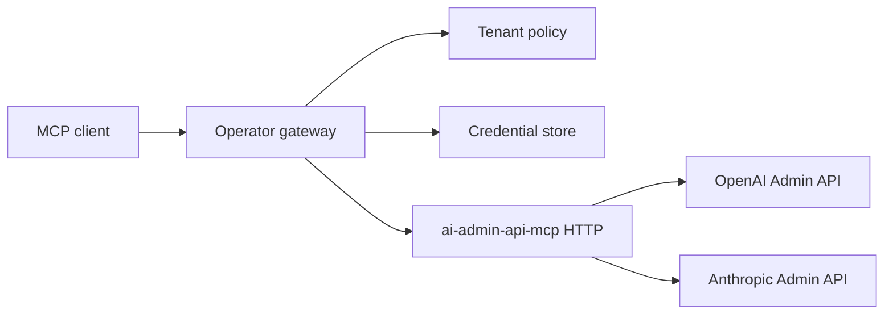

# Gateway Configuration Example

The v0.1 runtime does not implement pass-through credential envelopes directly. This example documents the intended deployment boundary for gateway authors.

The gateway should:

- authenticate the caller
- authorize the requested tool and provider
- resolve `credential_ref` to a short-lived provider credential
- attach credential material out of band
- prevent provider credentials from entering normal MCP tool arguments
- audit the tenant, provider, tool, credential ref, and outcome

Until a gateway adapter exists, run this server in static mode only.
